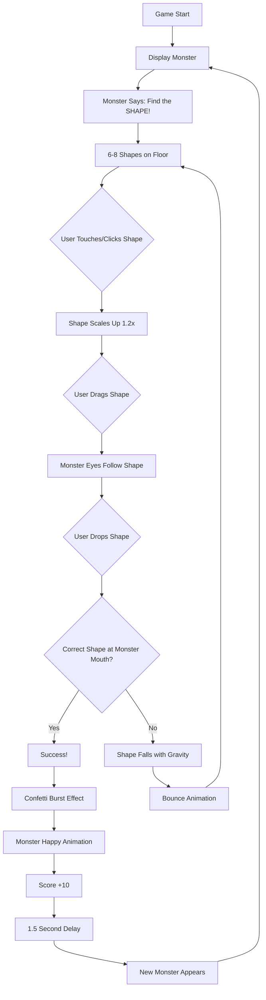
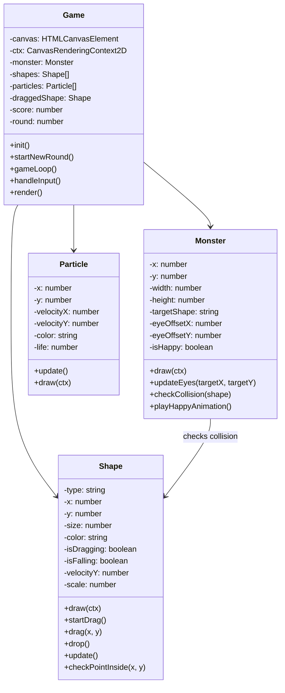
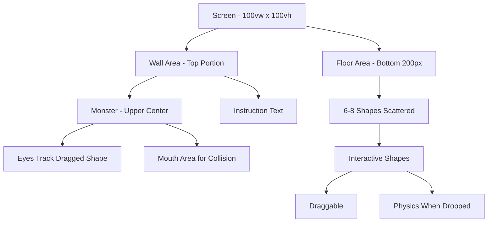
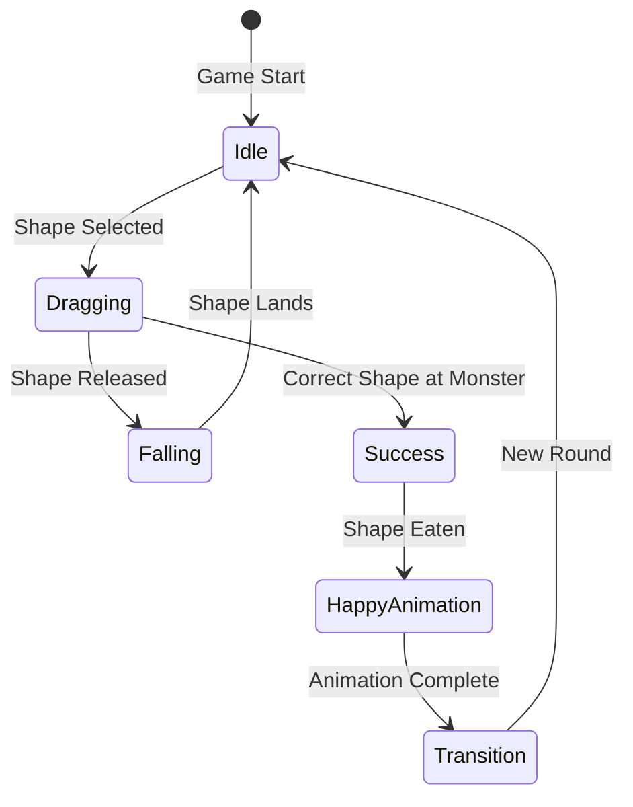
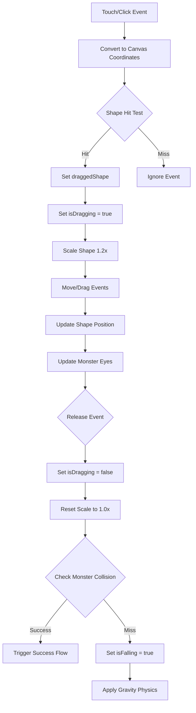

# Feed the Monster: Game Flow and Interaction Diagrams

## User Interaction Flow



## Class Interaction Diagram



## Screen Layout Diagram



## Animation State Machine



## Input Handling Flow



## Physics Simulation Flow

```mermaid
graph TD
    A[Shape Released] --> B[Set isFalling = true]
    B --> C[velocityY = 0]
    C --> D[Game Loop Update]
    D --> E[velocityY += GRAVITY]
    E --> F[y += velocityY]
    F --> G{y >= floorY?}
    G -->|No| D
    G -->|Yes| H[y = floorY]
    H --> I{|velocityY| > 0.5?}
    I -->|Yes| J[velocityY *= -BOUNCE_DAMPING]
    I -->|No| K[isFalling = false]
    J --> L[squash = 0.8]
    L --> M[squash += 0.05]
    M --> D
    K --> N[Settle on Floor]
```

## Visual Effects Timeline

```mermaid
gantt
    title Success Animation Timeline
    dateFormat X
    axisFormat %s
    
    section Shape Interaction
    Drag Scale Up     :0, 0.5s
    Hold Drag         :0.5, 2s
    
    section Success Sequence
    Collision Detect :2, 2.1s
    Confetti Burst    :2.1, 3s
    Monster Happy     :2.1, 3.5s
    Score Display     :2.5, 3s
    
    section Transition
    Delay             :3.5, 5s
    New Round         :5, 5.1s
```



## Color Palette Reference

| Element | Color | Hex Code |
|---------|-------|----------|
| Circle Shape | Soft Pink | #FFB3BA |
| Square Shape | Light Blue | #BAE1FF |
| Triangle Shape | Light Yellow | #FFFFBA |
| Star Shape | Light Green | #BAFFC9 |
| Rectangle Shape | Lavender | #E0BBE4 |
| Wall Gradient Start | Light Blue | #87CEEB |
| Wall Gradient End | Darker Blue | #4682B4 |
| Floor | Warm Brown | #8B4513 |
| Text | Dark Contrast | #333333 |

These diagrams provide a comprehensive visual representation of the game's mechanics, interactions, and implementation structure. They serve as a reference guide during development to ensure all components work together as intended.