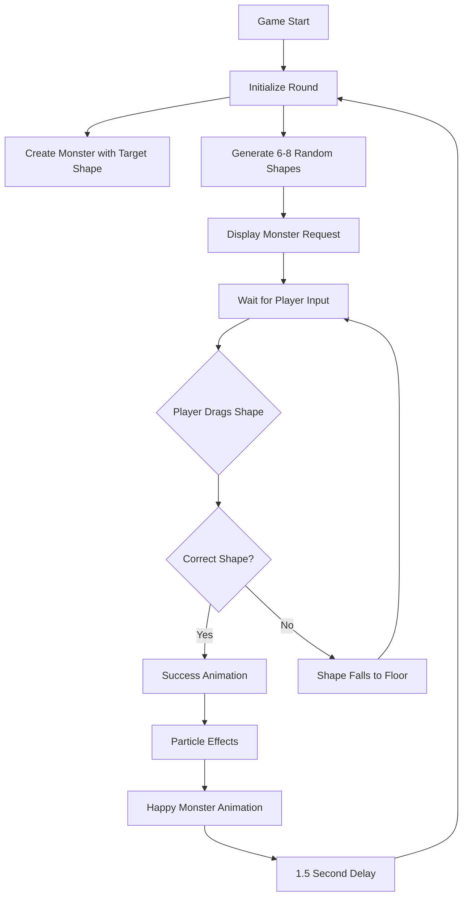

# Feed the Monster: Shape Recognition Game - Architecture Plan

## Game Overview
A single-file HTML5 Canvas game where children (ages 4-5) drag shapes to feed a hungry monster that requests specific shapes.

## Technical Architecture

### File Structure
- `index.html` - Single file containing all HTML, CSS, and JavaScript

### Core Class Structure

#### 1. Game Class (Main Controller)
- Manages game state, rounds, and scoring
- Handles initialization and main game loop
- Coordinates between all other classes
- Methods:
  - `init()` - Initialize canvas, event listeners, and first round
  - `startNewRound()` - Create new monster and shapes
  - `update()` - Main game loop update
  - `render()` - Main render loop
  - `handleMouseDown/touchStart()` - Input handling
  - `handleMouseMove/touchMove()` - Input handling
  - `handleMouseUp/touchEnd()` - Input handling

#### 2. Monster Class
- Represents the target shape that needs to be fed
- Handles drawing, animations, and eye tracking
- Properties:
  - `x, y` - Position on canvas
  - `width, height` - Dimensions
  - `targetShape` - The shape it wants to eat
  - `eyeOffsetX, eyeOffsetY` - For eye tracking
  - `isHappy` - Animation state
  - `animationTimer` - For happy animation
- Methods:
  - `draw(ctx)` - Render the monster
  - `updateEyes(targetX, targetY)` - Track dragged shape
  - `playHappyAnimation()` - Trigger success animation
  - `checkCollision(shape)` - Check if shape is at mouth

#### 3. Shape Class
- Represents draggable shape objects
- Handles drawing, physics, and interactions
- Properties:
  - `type` - 'square', 'circle', 'triangle', 'star', 'rectangle'
  - `x, y` - Current position
  - `floorY` - Original floor position
  - `size` - Shape dimensions
  - `color` - Pastel color based on type
  - `isDragging` - Current interaction state
  - `isFalling` - Physics state
  - `velocityY` - For gravity physics
  - `scale` - For drag scaling effect
  - `squash` - For bounce animation
- Methods:
  - `draw(ctx)` - Render the shape
  - `startDrag()` - Initialize drag state
  - `drag(x, y)` - Update position during drag
  - `drop()` - Start falling physics
  - `update()` - Update physics and animations
  - `checkPointInside(x, y)` - Hit testing

#### 4. Particle Class
- Simple particle for confetti effects
- Properties:
  - `x, y` - Position
  - `velocityX, velocityY` - Movement
  - `color` - Particle color
  - `size` - Particle size
  - `life` - Remaining lifetime
- Methods:
  - `update()` - Update position and life
  - `draw(ctx)` - Render particle

### Game Flow Diagram



### Implementation Details

#### Scene Rendering
- Wall: Radial gradient from light blue to darker blue
- Floor: Solid warm color (brown/wood) occupying bottom 200px
- All positions calculated relative to window dimensions

#### Input Handling
- Mouse events: mousedown, mousemove, mouseup
- Touch events: touchstart, touchmove, touchend
- Prevent default on touchmove to avoid scrolling
- Coordinate conversion for both input types

#### Physics System
- Simple gravity for falling shapes
- Bounce effect with damping
- Squash animation on impact
- All calculations use requestAnimationFrame timing

#### Visual Effects
- Shape scaling (1.2x) when dragging
- Eye tracking using angle calculations
- Confetti particles with random colors and velocities
- Smooth transitions between game states

#### Asset Configuration
```javascript
const ASSETS = {
  monsters: {
    circle: 'path/to/monster-circle.png',
    square: 'path/to/monster-square.png',
    // etc.
  }
};
```

### Color Palette
- Shapes: Soft pastels (pink, light blue, yellow, light green, lavender)
- Background: Light blue to darker blue gradient
- Floor: Warm brown or wood tone
- Text: High contrast dark color

### Responsive Design
- Canvas fills entire viewport (100vw, 100vh)
- All positions calculated as percentages of window dimensions
- Touch targets sized appropriately for young children
- Text scales based on screen size

### Performance Considerations
- Single requestAnimationFrame loop
- Efficient collision detection
- Object pooling for particles
- Minimal DOM manipulation

This architecture provides a solid foundation for implementing the complete game while maintaining clean, maintainable code structure.